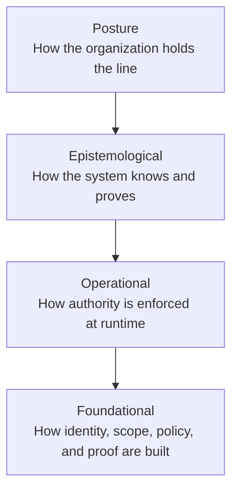

# Agent Responsibility Engineering (ARE)

**A discipline for governing autonomous AI agents in production.**

Agent Responsibility Engineering is the practice of making autonomous AI agents
legible, bounded, authorized, and provable before they take consequential
actions.

The short version:

> Intelligence is not authority. An agent may be capable of doing something and
> still have no right to do it.

ARE exists to make that boundary explicit.

## Why This Exists

Agents are already calling APIs, touching data, drafting communications,
triggering workflows, and operating inside regulated environments. Many systems
still rely on prompts, logs, dashboards, or after-the-fact review as the primary
control.

That is not enough for production governance.

ARE treats identity, scoped authority, policy, evidence, and auditability as
system primitives. The goal is not to slow agents down. The goal is to make them
trustworthy enough to move fast.

## The Tenets

### Foundational: how you build it

**I. Governance is architectural, not operational.**

Accountability cannot be retrofitted. Identity, authority, and proof must be
present from the first action.

**II. The spawn chain is the authority chain.**

Every agent must be traceable to a human or organizational origin. Delegation is
not inheritance; each step must explicitly scope what transfers.

**III. The ledger is ground truth.**

What an agent did is defined by durable evidence, not by what the agent reported
or what an operator remembers.

### Operational: how you run it

**IV. Intelligence never grants authority.**

Capability is not permission. Authorization must be explicit, bounded, and
separate from model capability.

**V. Scope is a contract, not a suggestion.**

An agent's scope is a binding constraint. Deviation is a governance event, not
just a behavior bug.

**VI. Trust has a half-life.**

Authorization degrades. Policies age. Models drift. The basis for trust must be
revalidated continuously.

### Epistemological: how you know it

**VII. Every agent must be provably legible.**

An authorized reviewer should be able to reconstruct who acted, what they were
allowed to do, what happened, and why.

**VIII. Proof requires falsification.**

Observation is not proof. A verified conclusion needs a record of what was
tested, what failed, what survived, and why.

### Posture: how you hold the line

**IX. An unknown agent is an ungovernable agent.**

An agent that cannot be identified, traced, and scoped has no standing in a
governed system.

**X. The system must explain itself.**

A governance system that only its builders can interpret has failed. Legibility
to operators, auditors, and affected people is the measure of whether governance
is actually governing.

## Four-Layer Model



| Layer | Question | Examples |
|---|---|---|
| Foundational | What must exist before any action? | agent identity, scoped authority, policy checks, ledger/proof root |
| Operational | How is it enforced while running? | runtime enforcement, scope contracts, drift checks, revocation |
| Epistemological | How do we know and prove it? | evidence freshness, falsification, source truth, replay |
| Posture | How does the organization keep the line? | ownership, escalation, review gates, safety culture |

## Public Research And Paper

This repository is the public discipline and research mirror. It includes:

| What | Where |
|---|---|
| Public STAMP/STPA paper PDF | [`STAMP_ARE_Paper.pdf`](STAMP_ARE_Paper.pdf) |
| Paper source | [`paper/STAMP_ARE_Paper_arxiv_ready.md`](paper/STAMP_ARE_Paper_arxiv_ready.md) |
| Paper pipeline notes | [`docs/stamp-paper/README.md`](docs/stamp-paper/README.md) |
| Public evidence summary | [`docs/stamp-paper/EVIDENCE_PUBLIC_SUMMARY.md`](docs/stamp-paper/EVIDENCE_PUBLIC_SUMMARY.md) |
| Validation tiers | [`docs/validation-tiers.md`](docs/validation-tiers.md) |
| Public/commercial boundary | [`docs/public-boundary.md`](docs/public-boundary.md) |
| Public STPA mirror | [`research/stpa/`](research/stpa/) |

The paper is a bounded safety argument. It is not a claim that all autonomous AI
systems are safe, and it is not a product certification.

## Implementation Relationship

This repo defines the discipline and publishes public research artifacts. It is
not the full ARE platform.

Related implementation surfaces:

- **ARE Foundation:** public S0/S1 foundation for actor identity, scoped
  authority, scope/policy evaluation, and public-safe proof basics.
- **Commercial ARE platform:** Command Center, visual RAG, BYOPolicy workflows,
  Live Pulse, synthetic proof monitors, richer proof replay, S2-S6 adaptive
  stages, and client/operator experiences.
- **Governance-strata:** higher-risk transition governance and orchestration
  concept used by the larger ARE platform; internals are not bundled here.
- **Guardian-Agent:** historical policy co-processor reference used in earlier
  thinking; later ARE architecture supersedes it for the current safety case.

See [`docs/public-boundary.md`](docs/public-boundary.md) for the explicit line
between public discipline material and private/commercial implementation.

## Evidence Model

Evidence is tiered:

| Tier | Purpose | Public? |
|---|---|---|
| Level 1 | Public paper and discipline framing | Yes |
| Level 2 | Public evidence summary and STPA mirror | Yes |
| Level 3 | Frozen hashed reviewer packet with raw logs and full gate outputs | By request / supplementary packet |

The public repo intentionally excludes raw logs, private proof bundles, protected
evidence bodies, customer payloads, credentials, tokens, and commercial platform
internals.

## Who This Is For

This work is for:

- platform engineers building agent runtimes
- governance, risk, and compliance teams evaluating agent controls
- safety engineers translating STAMP/STPA into agentic systems
- researchers studying accountable autonomous systems
- operators who need to prove an agent acted within authority

## How To Review This Repo

Start here:

1. Read the tenets above.
2. Read [`docs/public-boundary.md`](docs/public-boundary.md).
3. Read [`STAMP_ARE_Paper.pdf`](STAMP_ARE_Paper.pdf).
4. Inspect [`research/stpa/STPA_RESOLUTION.md`](research/stpa/STPA_RESOLUTION.md).
5. Check [`docs/stamp-paper/EVIDENCE_PUBLIC_SUMMARY.md`](docs/stamp-paper/EVIDENCE_PUBLIC_SUMMARY.md).

For a quick hygiene check:

```bash
python tools/check_public_repo.py
```

## Contributing

Contributions are welcome for the public discipline surface: terminology,
research references, STPA/STAMP clarity, examples, diagrams, and public-safe
documentation.

Do not contribute secrets, raw payloads, protected evidence, private proof
packets, confidential client material, raw policy bodies, credentials, tokens,
or commercial implementation internals.

See [`CONTRIBUTING.md`](CONTRIBUTING.md).

## Citation

Use [`CITATION.cff`](CITATION.cff) for citation metadata.

## License

Unless otherwise noted, the written materials, diagrams, papers, and public
research artifacts in this repository are licensed under the Creative Commons
Attribution 4.0 International License. See [`LICENSE`](LICENSE) and
[`NOTICE`](NOTICE).

Future executable code, if added, should include explicit SPDX headers and may
use a separate software license when stated.

## Author

Built by [Jonathan Kershaw](https://linkedin.com/in/jonjonkershaw), Principal AI
Platform Engineer and founding practitioner of governed autonomous runtimes.

[github.com/srex-dev](https://github.com/srex-dev)
